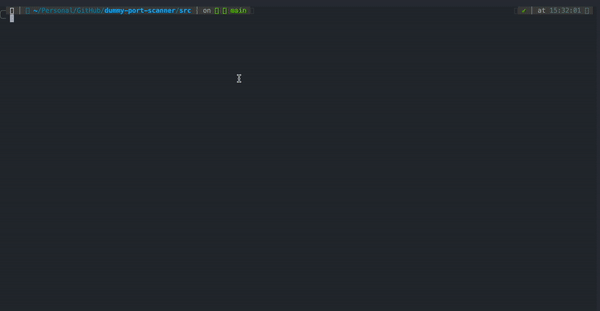

<div align="center">

<p>
  
</p>

<h2 align="center">✨ Dummy port scanner ✨</h2>

<div align="center">

[](https://github.com/lpmatos/dummy-port-scanner)
[](https://github.com/lpmatos/dummy-port-scanner)
[](https://github.com/lpmatos/dummy-port-scanner)

</div>

---

<p align="center">
  
</p>

<p align="center">
  ✨ Port Scanner is a simple CLI application designed to search servers or hosts for open ports ✨
</p>

<p align="center">
  <a href="#getting-started">Getting Started</a>&nbsp;&nbsp;&nbsp;|&nbsp;&nbsp;&nbsp;
  <a href="#concepts">Concepts</a>&nbsp;&nbsp;&nbsp;|&nbsp;&nbsp;&nbsp;
  <a href="#demo">Demo</a>&nbsp;&nbsp;&nbsp;|&nbsp;&nbsp;&nbsp;
  <a href="#versioning">Versioning</a>
</p>

</div>

---

## ➤ Getting Started <a name = "getting-started"></a>

If you want contribute on this project, first you need to make a **git clone**:

```bash
git clone --depth 1 https://github.com/lpmatos/dummy-port-scanner.git -b main
```

This will give you access to the code on your **local machine**.

## ➤ Important Note

**This tool is for educational and ethical practices only. The developers are not responsible if the tool is misused by an individual.**

## ➤ Installation <a name = "installation"></a>

```bash
python3 -m pip install -r requirements.txt
```

or

```bash
docker pull ghcr.io/lpmatos/dummy-port-scanner:main
```

## ➤ Usage <a name = "usage"></a>


```txt
$ python3 main.py --help

NAME
    main.py

SYNOPSIS
    main.py <flags>

FLAGS
    --target_host=TARGET_HOST
        Type: str
        Default: 'google.com'
    --target_ports=TARGET_PORTS
        Type: typing.List[int]
        Default: [443, 80]
    --mode=MODE
        Type: str
        Default: 'simple'
```

## ➤ Docker <a name = "docker"></a>

To run the docker container:

```bash
docker container run -it --rm ghcr.io/lpmatos/dummy-port-scanner:main
```

Click [here](https://github.com/lpmatos/dummy-port-scanner/pkgs/container/dummy-port-scanner/versions) to see available image tags.

## ➤ Features

- Pretty CLI.
- Docker container option.
- Scan target in a range of ports.
- Scan target given a list of ports.
- Scan target given a list of ports using Nmap.

## ➤ Concepts <a name = "concepts"></a>

This section aims to describe at a high level what the tools we use are and how we use them, without reproducing documentation that is better written (and more up to date) in the repositories and websites of these tools themselves. It's recommended to familiarize yourself with these tools as early as possible.

### Socket Programming

A socket uniquely identifies the endpoint of a communication link between two application ports. Socket programming is a way of connecting two nodes on a network to communicate with each other. One socket(node) listens on a particular port at an IP, while the other socket reaches out to the other to form a connection. The server forms the listener socket while the client reaches out to the server. They are the real backbones behind web browsing. In simpler terms, there is a server and a client.

A port represents an application process on a TCP/IP host, but the port number itself does not indicate the protocol being used: TCP, UDP, or IP. The application process might use the same port number for TCP or UDP protocols. To uniquely identify the destination of an IP packet arriving over the network, you have to extend the port principle with information about the protocol used and the IP address of the network interface; this information is called a socket. A socket has three parts: protocol, local-address, local-port.

The term association is used to specify completely the two processes that comprise a connection: protocol, local-address, local-port, foreign-address, foreign-port.

The terms socket and port are sometimes used as synonyms, but note that the terms port number and socket address are not like one another. A port number is one of the three parts of a socket address, and can be represented by a single number (for example, 1028) while a socket address can be represented by: tcp, myhostname, 1028.

### TCP/IP

Conceptually, the TCP/IP protocol stack consists of four layers, each layer consisting of one or more protocols. A protocol is a set of rules or standards that two entities must follow so as to allow each other to receive and interpret messages sent to them. The entities could, for example, be two application programs in an application protocol, or the entities might be two TCP protocol layers in two different IP hosts (the TCP protocol).

<p align="center">
  
</p>

Programs are located at the process layer; here they can interface with the two transport layer protocols (TCP and UDP), or directly with the network layer protocols (ICMP and IP).

* TCP: Transmission Control Protocol is a transport protocol providing a reliable, full-duplex byte stream. Most TCP/IP applications use the TCP transport protocol.
* UDP: User Datagram Protocol is a connectionless protocol providing datagram services. UDP is less reliable because there is no guarantee that a UDP datagram ever reaches its intended destination, or that it reaches its destination only once and in the same condition as it was passed to the sending UDP layer by a UDP application.
* ICMP: Internet Control Message Protocol is used to handle error and control information at the IP layer. The ICMP is most often used by network control applications that are part of the TCP/IP software product itself, but ICMP can be used by authorized user processes as well. PING and TRACEROUTE are examples of network control applications that use the ICMP protocol.
* IP: Internet Protocol provides the packet delivery services for TCP, UDP, and ICMP. The IP layer protocol is unreliable (called a best-effort protocol). There is no guarantee that IP packets arrive, or that they arrive only once and are error-free. Such reliability is built into the TCP protocol, but not into the UDP protocol. If you need reliable transport between two UDP applications, you must ensure that reliability is built into the UDP applications.
* ARP: The IPv4 networking layer uses the Address Resolution Protocol (ARP) to map an IP address into a hardware address. In the IPv6 networking layer, this mapping is performed by the Neighbor Discovery (ND function). On local area networks (LANs), such an address would be called a media access control (MAC) address.
* RARP: Reverse Address Resolution Protocol is used to reverse the operation of the ARP protocol. It maps a hardware address into an IPv4 address. Note that both ARP packets and RARP packets are not forwarded in IP packets, but are themselves media level packets. ARP and RARP are not used on all network types, as some networks do not need these protocols.

## ➤ Demo <a name = "demo"></a>

<p align="center">
  
</p>

## ➤ TL;DR

- Socket is an abstraction of an IP connection endpoint - so if you think of it as an API structure, you are not very far off.
- Internet layer i.e. IP Protocol. In practice you usually use explicitly sockets that bind to a certain transport layer parameters (datagram/UDP or stream/TCP)
- Sockets send data, in network byte order - whether it is text or binary, depends on the upper layer protocol.
- Theoretically, probably yes - but in practice all IP traffic is done using 'sockets'

## ➤ Author <a name = "author"></a>

👤 Hey!! If you like this project or if you find some bugs feel free to contact me in my channels:

>
> * Linktree: https://linktr.ee/lpmatos
>

## ➤ Versioning <a name = "versioning"></a>

To check the change history, please access the [**CHANGELOG.md**](CHANGELOG.md) file.

## ➤ Project status <a name = "project-status"></a>

This repository is a study project, therefore, it will not always be maintained 👻.

## ➤ Show your support <a name = "show-your-support"></a>

<div align="center">

Give me a ⭐️ if this project helped you!

<p>
  
</p>

Made with 💜 by [me](https://github.com/lpmatos) 👋 inspired on [readme-md-generator](https://github.com/kefranabg/readme-md-generator)

</div>
